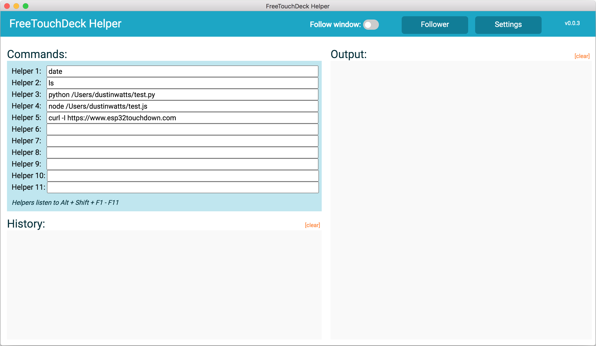

# FreeTouchDeck-Helper
 A simple app (Windows, MacOS, Linux) that gives shell access to your FreeTouchDeck. This app is written in Electron. It also the Follower. The follower let's you select which FreeTouchDeck menu to open when a certain app comes in to focus.

 

# Release

Go to [Releases](https://github.com/DustinWatts/FreeTouchDeck-Helper/releases) and download the build release for your OS. If you would like to build it yourself or modify it in any way, download the source code.

# The Follower

If you open the Follower, you will be greeted with the images below.

Here can select Application that when in focus, will auto switch FreeTouchDeck to that menu. To create a follower, you first have to start caputering applications. This will fill the list so you can select them. Click `Start Capture` and open the application you want to be in the list. Once done, you can stop capturing and select which menu will follow which application. Make sure to save! 

*** For the helper to work, FreeTouchDeck has to be connected to USB Serial on your computer. ***

# Build yourself

If you would like to build it yourself or modify it in any way, download the source code.

### Dependencies

To install dependencies use `npm install`. 

### Run

To run witout packing, use `npm start`.

### Release Build

To create a release build, use the following:

Windows `npm run package-win`

MacOs `npm run package-mac`

Linux `npm run package-linux`

You will find your builds in the 'FreeTouchDeck-Helper/release-builds'.
